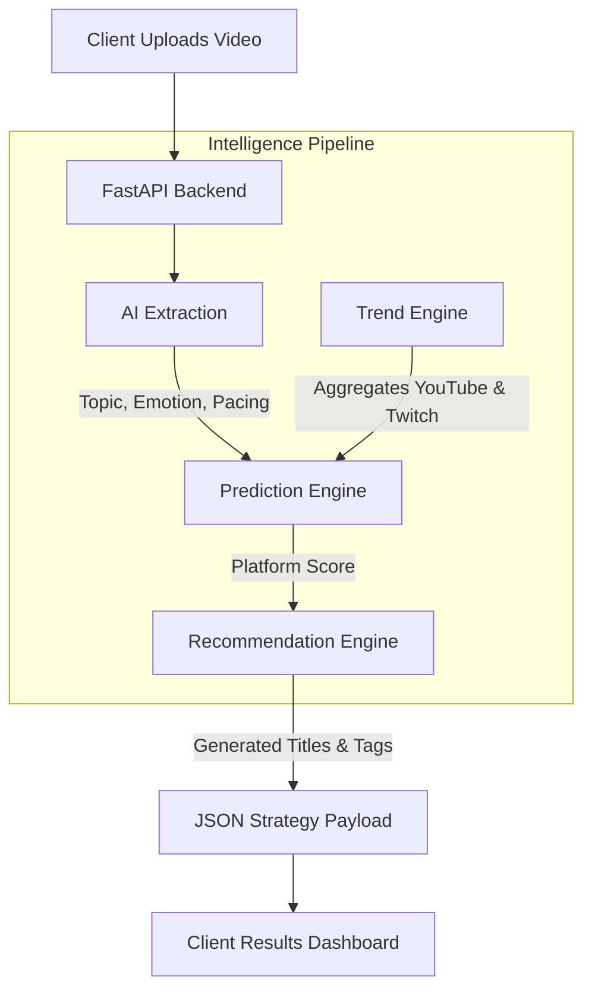

<div align="center">
  
# 🚀 Cratos
**Cross-Platform Content Intelligence for Modern Creators**

[](https://opensource.org/licenses/MIT)
[](https://www.python.org/downloads/)
[](https://nextjs.org/)
[](https://fastapi.tiangolo.com)
[](http://makeapullrequest.com)

</div>

---

Cratos is an advanced, AI-powered system designed to analyze raw video content and provide data-driven publishing strategies. By aggregating real-time momentum from major platforms and leveraging generative AI, Cratos determines the optimal platform for your video and automatically generates viral metadata to maximize your reach.

## 📑 Table of Contents
- [Key Features](#-key-features)
- [System Architecture](#-system-architecture)
- [Prerequisites](#-prerequisites)
- [Getting Started](#-getting-started)
- [Environment Variables](#-environment-variables)
- [API Documentation](#-api-documentation)
- [Current Development Status](#-current-development-status)
- [Contributing](#-contributing)
- [License](#-license)

---

## ✨ Key Features

- **🌐 Vibe Check Dashboard:** Get a real-time pulse of global trends. Aggregates live data from the **YouTube Data API** and **Twitch API** to show you exactly what topics are currently dominating the internet.
- **📝 Automated Metadata Generation:** Stop guessing what titles work. Cratos uses **Reka AI** to automatically generate highly optimized, viral video titles, descriptions, hashtags, and strategic posting schedules tailored precisely to your raw video.
- **🧠 Deep Content Analysis:** Processes raw video uploads to extract intrinsic topics, pacing, and emotional resonance using a localized AI pipeline (FFmpeg, OpenCV, and Whisper).
- **🎯 Predictive Platform Scoring:** A custom prediction engine evaluates your video's structural DNA against the current market "vibe" to determine whether it will perform better as a VOD (e.g., YouTube) or a Livestream (e.g., Twitch).
- **⚡ Zero-Setup Database:** Utilizes a serverless SQLite data layer to ensure instant onboarding and zero Docker overhead during local development.

---

## 🏗 System Architecture

The Cratos platform consists of a **FastAPI** backend that acts as the brain of the operation, driving three core intelligence engines, alongside a sleek **Next.js** frontend.



---

## 🛑 Prerequisites

Before you begin, ensure you have met the following requirements:
- **Python 3.9+**
- **Node.js 18+** (for the frontend)
- **FFmpeg** (Must be installed and available on your system path)
- **YouTube Data API Key** *(Strictly required for the Vibe Check dashboard)*
- **Twitch API Credentials** *(Strictly required for the Vibe Check dashboard)*
- **Reka AI API Key**

> [!WARNING]
> Cratos enforces strict real-time data for global trend discovery. If you do not configure your `YOUTUBE_API_KEY`, `TWITCH_CLIENT_ID`, and `TWITCH_CLIENT_SECRET` in your `.env` file, the **Vibe Check** frontend module will display a "No trends found" empty state rather than falling back to placeholder data.

---

## 🚀 Getting Started

Follow these steps to get your development environment set up:

### 1. Clone the repository
```bash
git clone https://github.com/your-org/cratos.git
cd cratos
```

### 2. Backend Setup
Navigate to the root directory and install Python dependencies:
```bash
pip install -r requirements.txt
```

Initialize the database:
```bash
python -c "from backend.data.database import init_db; init_db()"
```

Start the FastAPI server:
```bash
uvicorn backend.main:app --reload --port 8000
```

### 3. Frontend Setup
Open a new terminal, navigate to the frontend directory, and install dependencies:
```bash
cd frontend
npm install
npm run dev
```
Your frontend should now be running on `http://localhost:3000`.

---

## ⚙️ Environment Variables

Create a `.env` file in the root directory. Use `.env.example` as a template and populate the necessary credentials:

```ini
# Backend API Keys
YOUTUBE_API_KEY="your_youtube_data_api_key"
TWITCH_CLIENT_ID="your_twitch_client_id"
TWITCH_CLIENT_SECRET="your_twitch_client_secret"
REKA_API_KEY="your_reka_ai_api_key"

# Frontend config
NEXT_PUBLIC_API_BASE_URL="http://localhost:8000"
```

---

## 📖 API Documentation

Once the backend server is running, you can explore the complete Swagger UI documentation for all endpoints interactively:

- **Swagger UI:** [http://localhost:8000/docs](http://localhost:8000/docs)
- **ReDoc:** [http://localhost:8000/redoc](http://localhost:8000/redoc)

You can also view our strict Open API contracts at `contracts/openapi.yaml`.

---

## 🛠 Current Development Status

- ✅ **Backend Intelligence Pipeline:** Fully completed and integrated.
- ✅ **Trend & Prediction Engines:** Live with real-time API aggregation.
- 🚧 **Frontend Dashboard:** Currently under active development (Next.js / Tailwind).
- 🚧 **E2E Testing:** Pending final dashboard integration.

---

## 🤝 Contributing

Contributions are what make the open-source community such an amazing place to learn, inspire, and create. Any contributions you make are **greatly appreciated**.

1. Fork the Project
2. Create your Feature Branch (`git checkout -b feature/AmazingFeature`)
3. Commit your Changes (`git commit -m 'Add some AmazingFeature'`)
4. Push to the Branch (`git push origin feature/AmazingFeature`)
5. Open a Pull Request

---

## 📜 License

Distributed under the MIT License. See `LICENSE` for more information.